# Raport securitate - AuthX

## Coperta

- Curs: Dezvoltarea Aplicatiilor Software Securizate
- Facultatea de Matematica si Informatica, Universitatea din Bucuresti
- Cadru didactic: Conf. Univ. Dr. Marius Iulian Mihailescu
- Titlu proiect: Break the Login - Atacarea si securizarea autentificarii
- Student: Anghel Madalina 461

## Abstract

Acest proiect prezinta proiectarea, implementarea, exploatarea si remedierea unui mecanism de autentificare pentru aplicatia interna fictiva AuthX. Aplicatia a fost construita in doua versiuni distincte: o varianta initiala vulnerabila (v1), folosita pentru demonstratii controlate de ethical hacking, si o varianta securizata (v2), in care vulnerabilitatile identificate au fost remediate prin controale moderne de securitate. Scopul principal a fost intelegerea practica a modului in care un atacator poate compromite autentificarea, sesiunea si resetarea parolei, dar si validarea faptului ca remedierile blocheaza atacurile initiale.

In varianta v1 au fost implementate intentional slabiciuni uzuale: parole triviale acceptate la inregistrare, lipsa rate limiting la login, mesaje diferentiate ce permit user enumeration, token-uri de sesiune predictibile si flux de resetare parola cu token reutilizabil si fara expirare. Aceste slabiciuni au fost demonstrate prin PoC-uri reproductibile folosind curl. Impactul practic include compromiterea credentialelor, preluarea conturilor, persistenta neautorizata in sesiuni si cresterea suprafetei de atac in cazul unei aplicatii reale.

In varianta v2 au fost introduse masuri defensive aliniate cu bune practici: password policy minima, hash modern al parolelor, blocare temporara dupa incercari repetate, raspuns generic la autentificare, sesiuni cu token random si cookie hardening, precum si reset token one-time cu expirare scurta. Toate PoC-urile din v1 au fost reluate in faza de re-test, iar rezultatele confirma ca exploatarile initiale nu mai functioneaza in aceeasi forma.

Concluzia proiectului este ca securitatea autentificarii nu depinde de o singura masura, ci de combinarea controalelor defensive la nivel de parola, sesiune, raspunsuri API, rate limiting, audit si validare continua. Proiectul demonstreaza tranzitia de la o implementare functionala dar riscanta la una rezilienta si verificabila.

## Cuprins

1. Introducere
2. Arhitectura aplicatiei
3. Setup mediu laborator
4. Implementare MVP
5. Vulnerabilitati initiale (v1)
6. Demonstrarea atacurilor (PoC)
7. Analiza impact
8. Implementare fix-uri (v2)
9. Re-test dupa fix
10. Audit si trasabilitate
11. Concluzii si lectii invatate
12. Anexe

## 1. Introducere

Autentificarea reprezinta punctul de intrare in aproape orice aplicatie care gestioneaza date sensibile. Daca mecanismul de login, gestiunea parolelor sau managementul sesiunii sunt implementate superficial, atacatorul poate trece de controlul de acces inainte ca aplicatia sa aplice orice alta regula de securitate. Din aceasta cauza, majoritatea ghidurilor de secure coding trateaza autentificarea ca pe un control critic de nivel infrastructural.

Scopul acestui proiect a fost dublu. In prima etapa, aplicatia a fost dezvoltata in mod intentionat vulnerabil pentru a simula erori frecvente intalnite in proiecte reale aflate sub presiune de timp. In a doua etapa, aceleasi puncte slabe au fost remediate prin masuri tehnice concrete, apoi validate prin re-test. Studentul a avut rol dublu: security tester si developer.

Auditul a fost limitat la fluxurile cerute de tema:
- register
- login
- logout
- mentinerea sesiunii
- resetare parola

Aplicatia nu urmareste functionalitati de business complexe, ci un nucleu de autentificare care poate fi analizat usor in laborator. Astfel, se poate demonstra clar relatia cauza-efect dintre o vulnerabilitate si impactul ei.

## 2. Arhitectura aplicatiei

### 2.1 Tehnologii folosite

- Limbaj: Python
- Framework web: Flask
- Baza de date: SQLite
- Client de test: curl (plus optional Postman/Burp)

Aceasta alegere ofera un setup minim, repetabil si usor de rulat local in VM, ceea ce permite focus pe securitate, nu pe complexitatea infrastructurii.

### 2.2 Componente

- API backend
API-ul expune endpoint-uri REST pentru inregistrare, autentificare, logout, resetare parola, identitate curenta si operatii pe tickets.

- Persistenta
Baza SQLite stocheaza utilizatori, sesiuni, token-uri de resetare, ticket-uri si jurnal de audit.

- Componenta de test
Atacurile si retestele se executa prin comenzi scriptabile, pentru reproductibilitate.

### 2.3 Model de date

Tabelul users:
- id: identificator unic
- username, email: unice
- parola: in v1 plaintext, in v2 hash
- role: USER sau MANAGER
- campuri anti brute-force in v2: failed_login_attempts, locked_until

Tabelul sessions:
- user_id
- token / token_hash
- created_at, expires_at

Tabelul password_reset_tokens:
- user_id
- token / token_hash
- created_at, expires_at
- used (in v2)

Tabelul tickets:
- owner_id pentru control ownership si prevenire IDOR

Tabelul audit_logs:
- user_id, action, resource, timestamp, ip_address, details

Schema bazei de date a fost validata prin inspectia tabelelor in timpul rularii.

## 3. Setup mediu laborator

Mediul de lucru a fost pregatit intr-o masina virtuala pentru izolare, reproducibilitate si conformitate cu baremul. In proiect au fost folosite pachete standard Python, fara dependinte externe riscante.

### 3.1 Date mediu

- Hypervisor: VirtualBox
- OS VM: Ubuntu 24.04 LTS
- Hostname: authx-vm
- User VM: anghel.madalina.461
- Python: 3.12

### 3.2 Instalare

Comenzi folosite:

```bash
python3 -m venv .venv
source .venv/bin/activate
pip install -r vulnerable/requirements.txt
pip install -r fixed/requirements.txt
```

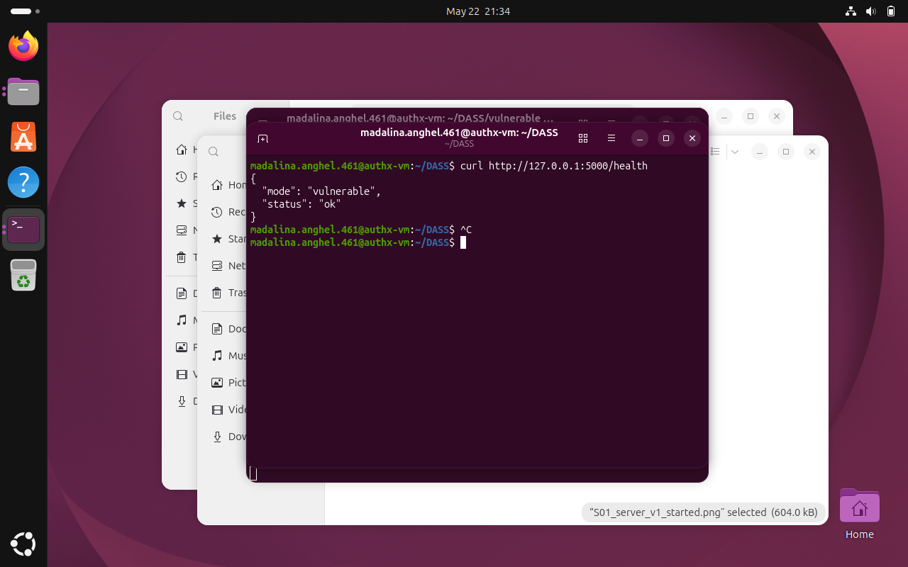

### 3.3 Pornire aplicatie

v1:

```bash
cd vulnerable
python app.py
```

v2:

```bash
cd fixed
python app.py
```

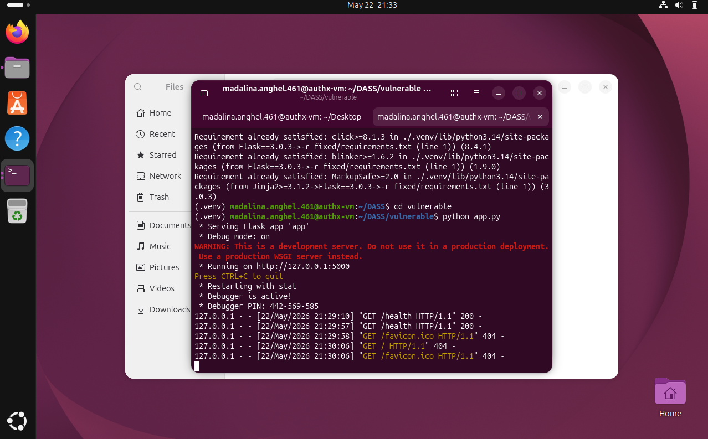

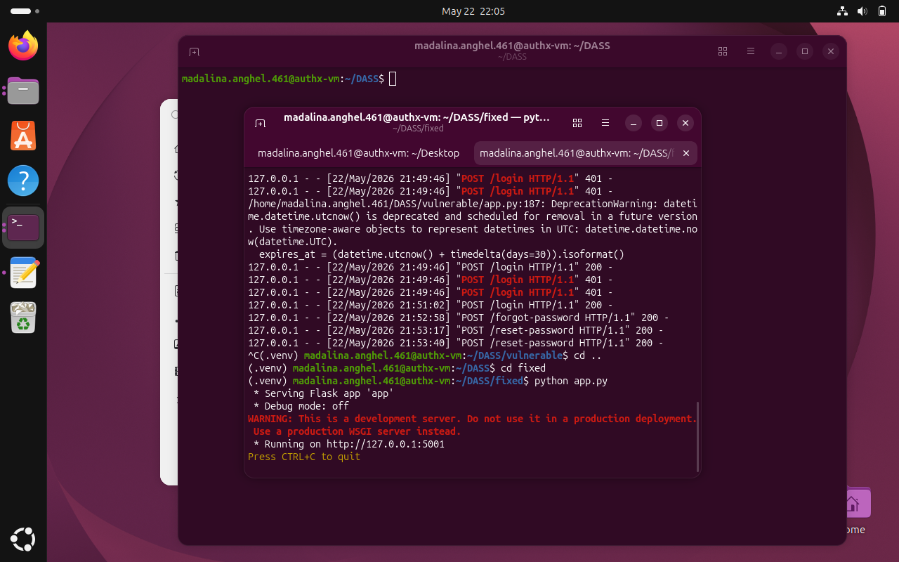

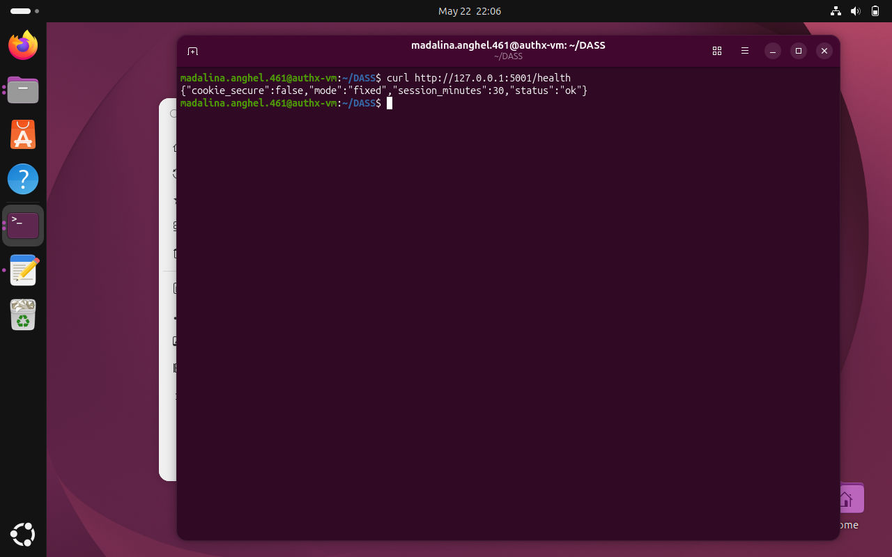

## 4. Implementare MVP

Aplicatia include fluxurile obligatorii cerute in tema.

### 4.1 Register

Endpoint: POST /register

Input:
- username
- email
- password

Output:
- mesaj de confirmare sau eroare

In v1 validarea parolei este minima, ceea ce permite parole slabe. In v2 se aplica o politica explicita.

### 4.2 Login

Endpoint: POST /login

Input:
- username
- password

Output:
- creare sesiune si cookie

v1 foloseste model nesigur de sesiune, v2 foloseste token random si expirare controlata.

### 4.3 Logout

Endpoint: POST /logout

Elimina sesiunea activa si sterge cookie-ul. In v2 invalidarea token-ului este stricta.

### 4.4 Forgot password + Reset password

Endpoint-uri:
- POST /forgot-password
- POST /reset-password

v1 foloseste token predictibil si reutilizabil. v2 introduce token random, expirare scurta si invalidare la folosire.

### 4.5 Mentinere sesiune

Endpoint: GET /me

Fiecare request autenticat este asociat cu utilizatorul logat prin cookie-ul de sesiune.

### 4.6 Ticket-uri

Endpoint-uri:
- POST /tickets
- GET /tickets/<id>

In v2, accesul la ticket este conditionat de ownership sau rol MANAGER.

## 5. Vulnerabilitati initiale (v1) - mapping cerinte 4.1-4.6

### 5.1 4.1 Password policy slab

Descriere:
v1 permite parole foarte scurte sau triviale, fara complexitate minima.

Consecinta:
Creste dramatic probabilitatea de compromitere prin credential stuffing sau brute force.

Mapping OWASP:
Authentication Failures.

### 5.2 4.3 Brute force / lipsa rate limiting

Descriere:
Numar nelimitat de incercari la login.

Consecinta:
Atacatorul poate automatiza incercari pana nimereste parola.

Mapping OWASP:
Identification and Authentication Failures.

### 5.3 4.4 User Enumeration

Descriere:
Mesaj diferit pentru utilizator inexistent vs parola gresita.

Consecinta:
Atacatorul poate construi o lista de useri validi.

### 5.4 4.5 Gestionare nesigura sesiuni

Descriere:
Token predictibil si cookie fara hardening.

Consecinta:
Risc de session hijacking, replay si furt de sesiune.

### 5.5 4.6 Resetare parola nesigura

Descriere:
Token predictibil, reutilizabil si fara expirare.

Consecinta:
Preluare cont la distanta daca token-ul este ghicit sau interceptat.

## 6. Demonstrarea atacurilor (PoC)

Toate atacurile au fost executate controlat in laborator, pe aplicatia proprie.

### PoC-01: Parola slaba acceptata

Scop:
Demonstratie ca nu exista politica minima la register in v1.

Comanda:

```bash
curl -i -X POST http://127.0.0.1:5000/register \
	-H "Content-Type: application/json" \
	-d '{"username":"alice","email":"alice@example.com","password":"123"}'
```

Rezultat:
Contul este creat cu parola "123".

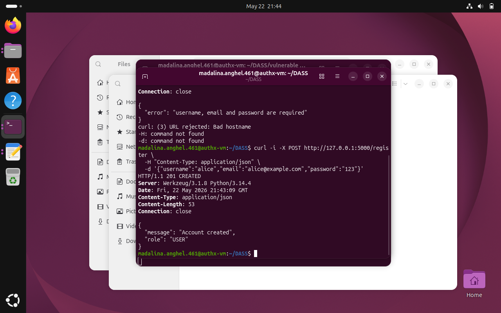

### PoC-02: User enumeration

Scop:
Demonstratie ca raspunsul dezvaluie daca userul exista.

Comenzi:

```bash
curl -i -X POST http://127.0.0.1:5000/login \
	-H "Content-Type: application/json" \
	-d '{"username":"no_such_user","password":"x"}'
```

```bash
curl -i -X POST http://127.0.0.1:5000/login \
	-H "Content-Type: application/json" \
	-d '{"username":"alice","password":"wrong"}'
```

Rezultat:
Mesaje diferite, deci enumerarea este posibila.

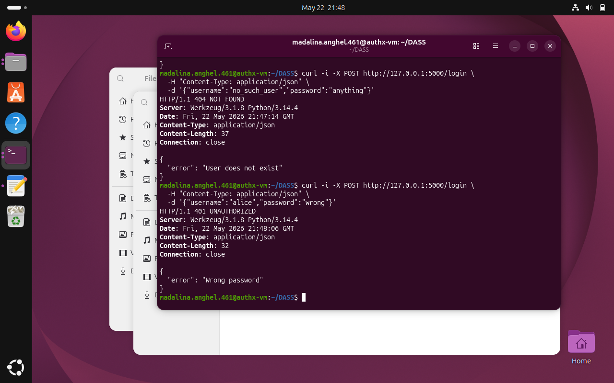

### PoC-03: Brute force fara limitare

Scop:
Demonstratie ca login permite incercari nelimitate.

Script:

```bash
for p in 0000 1111 123 admin qwerty; do
	curl -s -X POST http://127.0.0.1:5000/login \
		-H "Content-Type: application/json" \
		-d "{\"username\":\"alice\",\"password\":\"$p\"}"
done
```

Rezultat:
Nu apare lock de cont.

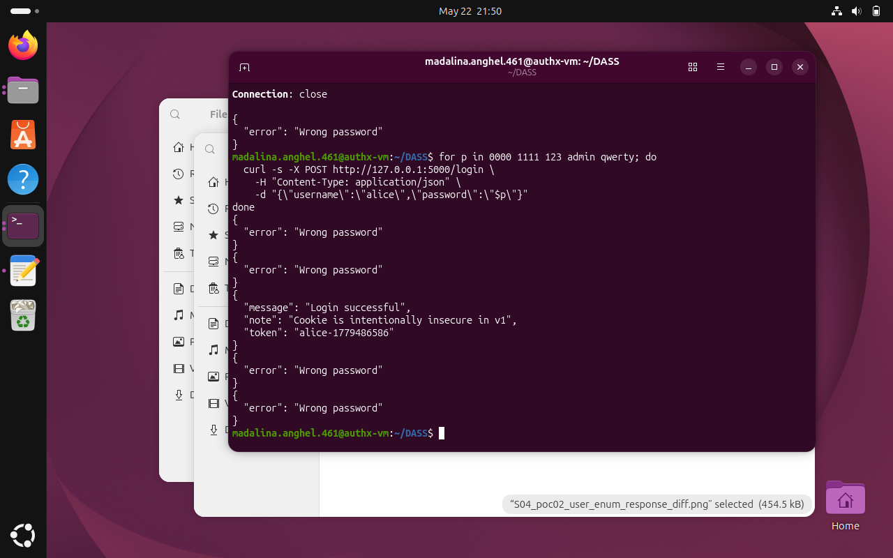

### PoC-04: Sesiune predictibila

Scop:
Demonstratie ca token-ul poate fi anticipat.

Comanda:

```bash
curl -i -c cookies_v1.txt -X POST http://127.0.0.1:5000/login \
	-H "Content-Type: application/json" \
	-d '{"username":"alice","password":"123"}'
```

Rezultat:
Token in format previzibil (username + timestamp).

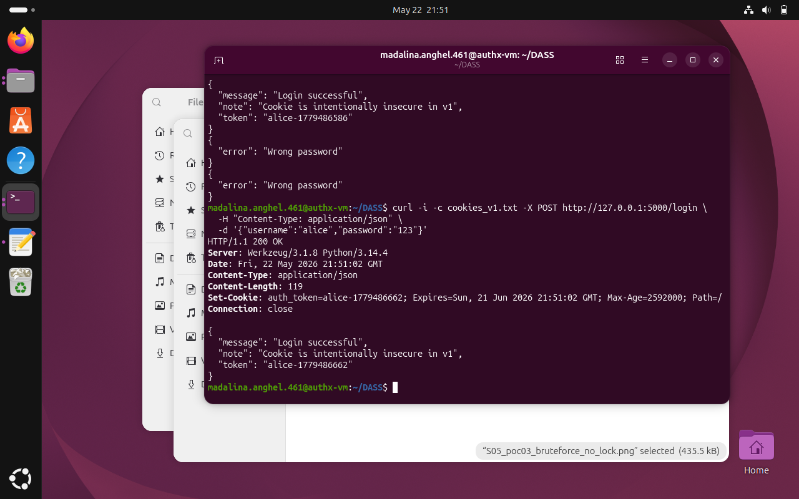

### PoC-05: Reset token predictibil si reutilizabil

Scop:
Demonstratie ca resetarea parolei poate fi abuzata.

Comanda 1:

```bash
curl -i -X POST http://127.0.0.1:5000/forgot-password \
	-H "Content-Type: application/json" \
	-d '{"username":"alice"}'
```

Comanda 2 (prima utilizare):

```bash
curl -i -X POST http://127.0.0.1:5000/reset-password \
	-H "Content-Type: application/json" \
	-d '{"token":"reset-1","new_password":"new123"}'
```

Comanda 3 (reutilizare acelasi token):

```bash
curl -i -X POST http://127.0.0.1:5000/reset-password \
	-H "Content-Type: application/json" \
	-d '{"token":"reset-1","new_password":"again123"}'
```

Rezultat:
Tokenul poate fi folosit repetat.

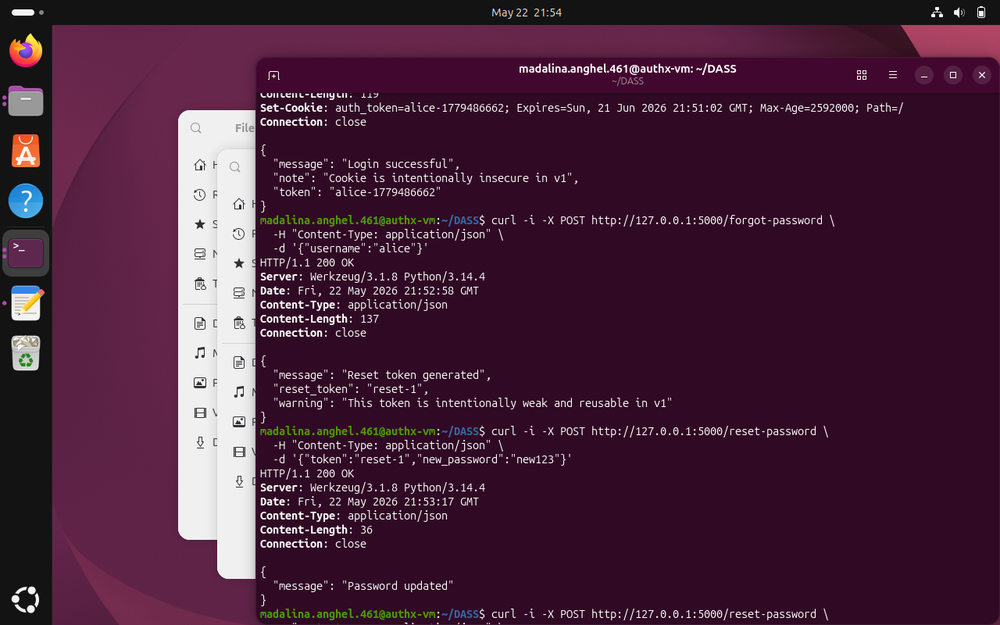

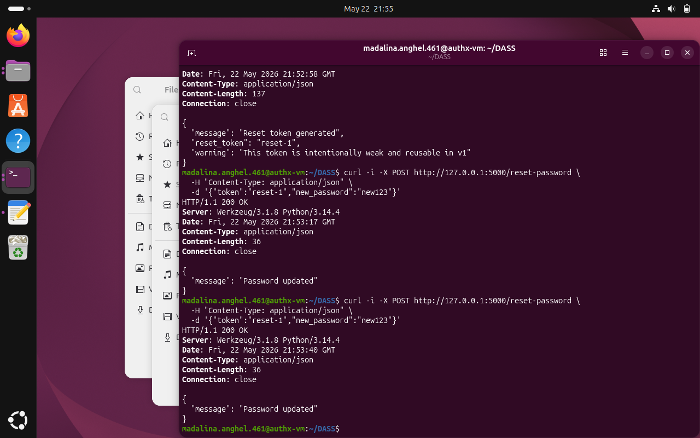

## 7. Analiza impact

Impactul cumulat al vulnerabilitatilor din v1 este ridicat. Un atacator poate porni cu enumerarea conturilor, continua cu brute force asupra userilor validi, apoi mentine accesul prin sesiuni slab protejate sau reseteaza parola folosind token-uri predictibile.

Evaluare severitate:
- 4.5 sesiuni predictibile: high
- 4.6 reset token nesigur: high
- 4.3 brute force: high
- 4.4 enumeration: medium
- 4.1 password policy slab: medium-high

Prioritate de remediere:
1. hardening sesiune si reset token
2. brute force protection
3. uniformizare raspunsuri login
4. consolidare password policy

## 8. Implementare fix-uri (v2)

### 8.1 Password policy

Implementare:
Validare la register si reset password: minim 10 caractere, litera mare, litera mica, cifra, caracter special.

Efect:
Scade probabilitatea parolelor triviale.

### 8.2 Protectie brute force

Implementare:
- lock temporar cont dupa N incercari esuate
- limitare burst pe IP
- logare tentativa in audit

Efect:
Atacul automatizat devine costisitor si detectabil.

### 8.3 Eliminare user enumeration

Implementare:
- mesaj unic `Invalid credentials`
- raspuns cu timp minim uniform

Efect:
Nu mai pot fi diferentiate conturile existente pe baza erorii.

### 8.4 Session hardening

Implementare:
- token de sesiune random (nepredictibil)
- expirare sesiune scurta
- rotatie sesiune la login
- invalidare stricta la logout
- cookie: HttpOnly + SameSite=Strict + Secure (configurabil)

Efect:
Reduce riscul de furt/replay sesiune.

### 8.5 Resetare parola securizata

Implementare:
- token random
- token one-time
- expirare scurta (10 minute)
- invalidare dupa utilizare

Efect:
Elimina reutilizarea token-ului.

Implementarea fix-urilor este demonstrata prin rezultatele de re-test de mai jos, care confirma comportamentul securizat.

## 9. Re-test dupa fix

Atacurile din v1 au fost reluate pe v2, folosind aceeasi metodologie.

### Re-test 01: parola slaba

Rezultat asteptat:
register cu parola "123" este respins.

Rezultat obtinut:
HTTP 400 Password policy failed.

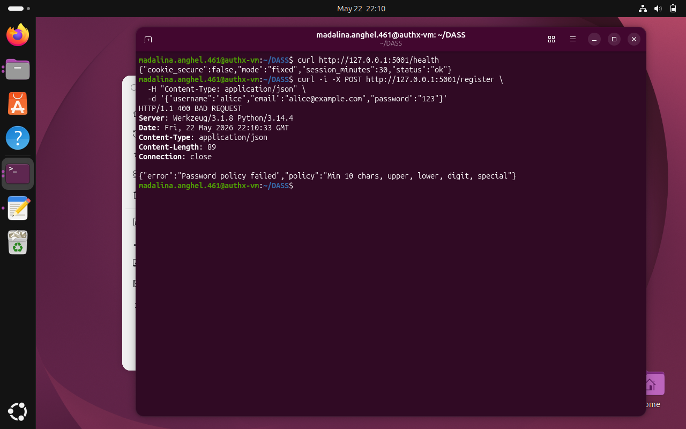

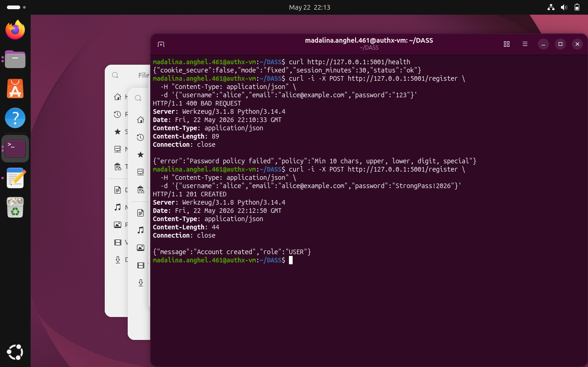

### Re-test 02: user enumeration

Rezultat asteptat:
acelasi mesaj pentru user invalid/parola invalida.

Rezultat obtinut:
`Invalid credentials` in ambele cazuri.

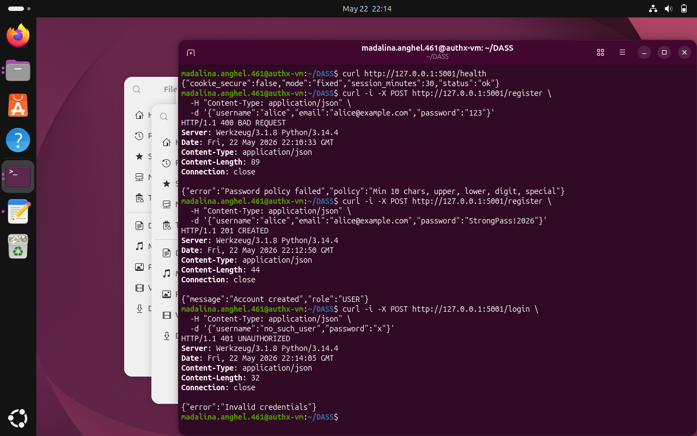

### Re-test 03: brute force

Rezultat asteptat:
cont blocat temporar dupa numarul limita de incercari.

Rezultat obtinut:
incercarile repetate nu mai duc la autentificare.

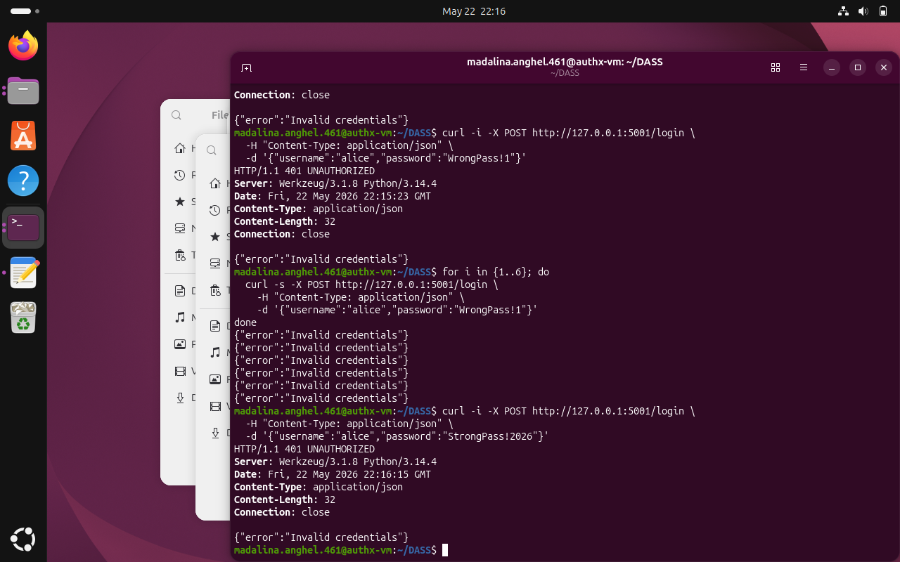

### Re-test 04: sesiune

Rezultat asteptat:
token nepredictibil, cookie hardening prezent.

Rezultat obtinut:
header Set-Cookie include HttpOnly si SameSite=Strict.


### Re-test 05: reset token

Rezultat asteptat:
token valid o singura data, apoi invalid.

Rezultat obtinut:
a doua utilizare returneaza Invalid or expired token.

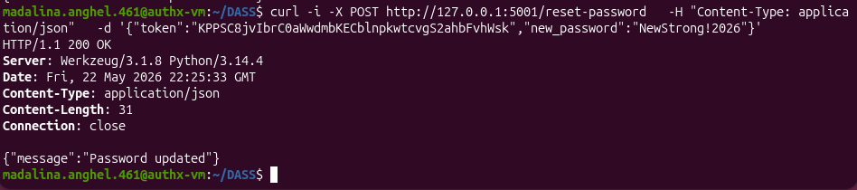

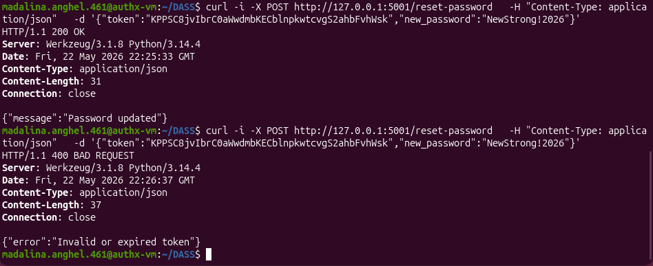

Concluzie re-test:
PoC-urile initiale nu mai sunt reproductibile in aceeasi forma, ceea ce confirma eficienta fix-urilor implementate.

## 10. Audit si trasabilitate

Aplicatia logheaza actiuni relevante pentru securitate:
- REGISTER
- LOGIN_SUCCESS
- LOGIN_FAILED
- LOGIN_BLOCKED
- FORGOT_PASSWORD
- PASSWORD_RESET
- CREATE_TICKET

Informatii stocate in audit:
- user_id
- action
- resource
- resource_id
- timestamp
- ip_address
- details

Utilitate practica:
- investigare incidente
- corelare tentative brute-force
- dovada post-eveniment pentru forensics de baza

Jurnalizarea evenimentelor de autentificare este evidentiata prin actiunile capturate in fluxurile de test si re-test.

## 11. Concluzii si lectii invatate

Proiectul confirma ca o aplicatie poate fi perfect functionala din punct de vedere business, dar in acelasi timp vulnerabila sever daca fluxurile de autentificare nu sunt protejate. Diferenta dintre v1 si v2 nu este data de complexitatea codului, ci de disciplina de securitate aplicata consecvent.

Ca security tester, principala lectie este ca atacurile eficiente pornesc din erori aparent mici: un mesaj diferit, lipsa unei limite de incercari sau un token slab pot fi combinate intr-un lant de compromitere.

Ca developer, lectia principala este ca securitatea trebuie proiectata de la inceput, nu adaugata la final. Controalele de baza pentru parole, sesiuni si reset token sunt obligatorii, nu optionale.

Imbunatatiri viitoare:
- CSRF protection explicita pe endpoint-uri sensibile
- HTTPS end-to-end in mediu de test
- MFA pentru conturi privilegiate
- integrare SAST/DAST in pipeline CI/CD
- teste automate de securitate la fiecare commit

## 12. Anexe

### Anexa A - Comenzi folosite

Comenzile folosite in demonstratii sunt incluse in sectiunile PoC si Re-test din prezentul document.

### Anexa B - Dovada separare versiuni

Proiectul include doua implementari distincte:
- vulnerable/ (v1)
- fixed/ (v2)

